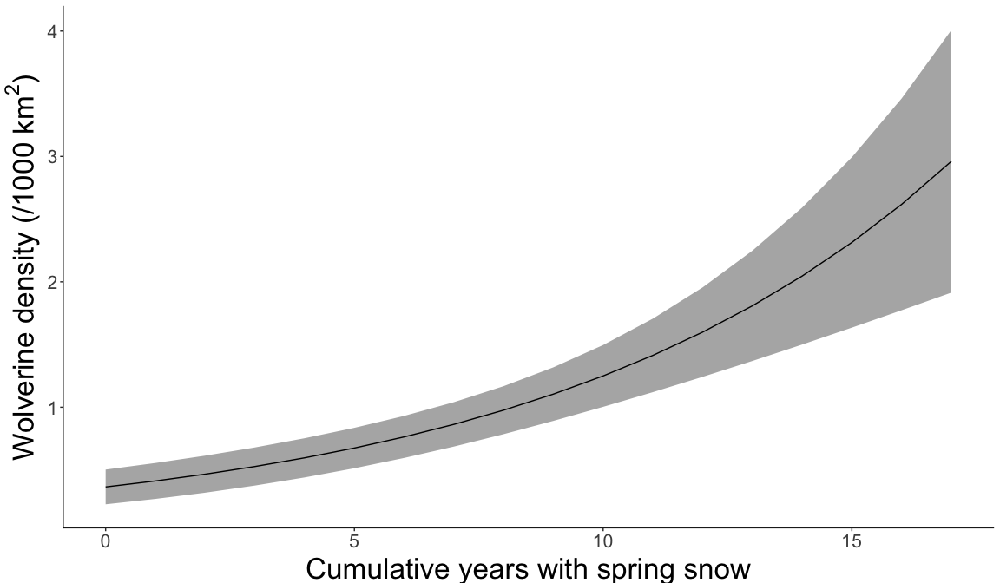
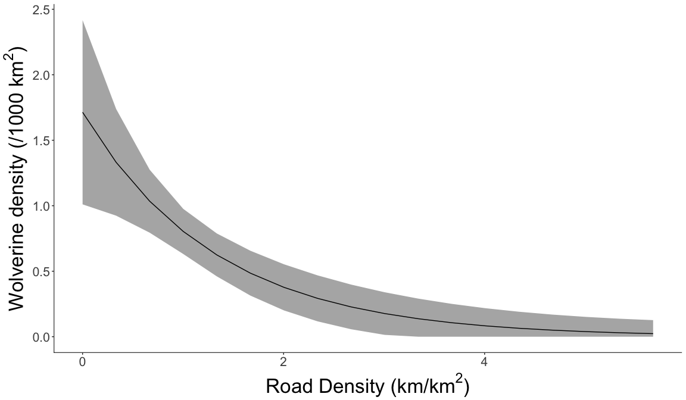

Wolverine Population Estimate and Drivers of Density
================
Clayton T. Lamb, PhD Student, University of Alberta
10 July, 2019

### Load Data

``` r
#################################
### ##Wolverine meta-analysis for West Kootenay population data
#################################

##Load Packages
library(secr)
library(ggplot2)
library(ggmap)
library(rgdal)
library(rgeos)
library(raster)
library(here)
library(plyr)
library(viridis)
library(GISTools)
library(corrplot)
library(velox)
library(knitr)
library(tidyverse)

###################################
##### LOAD DATA
###################################

##Read capture history files


EK <- read.capthist(here::here("CapHist2018","EK_encounter history_checkedMB.txt"), 
                         c(
  EK14 = here::here("CapHist2018","Trapfile_EK2014_tn_snow_no session.txt"),
  EK15 = here::here("CapHist2018","Trapfile_EK2015_tn_snow_no session_checkedMB.txt"),
  EK16 = here::here("CapHist2018","Trapfile_EK2016_tn_snow_no session.txt")
), 
                        detector ="proximity",
                        covname = 'Gender',
                        trapcovnames="snowdepth",
                        binary.usage=FALSE)


WK <- read.capthist(here::here("CapHist2018",'WK_encounter history.txt'), 
                        c(
  CP = here::here("CapHist2018",'Trapfile_CP2016_tn_snow_noses.txt'),
  CS = here::here("CapHist2018",'Trapfile_CS2014_tn_snow_noses.txt'),
  SP = here::here("CapHist2018",'Trapfile_SP2013_tn_snow_noses.txt'),
  SS = here::here("CapHist2018",'Trapfile_SS2012_tn_snow_noses.txt'),
   V = here::here("CapHist2018",'Trapfile_V2015_tn_snow_noses.txt')
),
                        detector ="proximity",
                        covname = 'Gender',
                        trapcovnames="snowdepth",
                        binary.usage = FALSE)


BYK <- read.capthist(here::here("CapHist2018",'BYK_encounter history_checkedMB.txt'), 
                        c(
  B11 = here::here("CapHist2018",'Trapfile_BYK2011_tn_snow_noses.txt'),
  B12 = here::here("CapHist2018",'Trapfile_BYK2012_tn_snow_noses.txt'),
  B13 = here::here("CapHist2018",'Trapfile_BYK2013_tn_snow_noses.txt')
),
                        detector ="proximity",
                        covname = 'Gender',
                        trapcovnames="snowdepth",
                        binary.usage = FALSE)


GNP <- read.capthist(here::here("CapHist2018",'MRGNP_encounter history.txt'), 
                        c(
  R11 = here::here("CapHist2018",'Trapfile_MRGNP2011_tn_snow.txt'),
  R12 = here::here("CapHist2018",'Trapfile_MRGNP2012_tn_snow.txt'),
  R14 = here::here("CapHist2018",'Trapfile_MRGNP2014_tn_snow.txt'),
  R15 = here::here("CapHist2018",'Trapfile_MRGNP2015_tn_snow.txt'),
  R16 = here::here("CapHist2018",'Trapfile_MRGNP2016_tn_snow.txt')
),
                        detector ="proximity",
                        covname = 'Gender',
                        trapcovnames="snowdepth",
                        binary.usage = FALSE)


##Bind together
guloCH <- MS.capthist(BYK, EK, WK,  GNP)


##fix up sex covariate factor levels
for (i in 1:length(guloCH))
    levels(covariates(guloCH[[i]])$Gender) <- c('F','M')
```

Summary of Detections and Spatial Recaptures
--------------------------------------------

``` r
caps <- ldply(as.data.frame(guloCH), data.frame)
traps <- data.frame()
  for(i in 1:16){
   traps <-  rbind(traps, data.frame(TrapID=dimnames(traps(guloCH)[[i]])[[1]], traps(guloCH)[[i]]))
  }
traps <- distinct(traps)


###join
df <- left_join(caps, traps, by="TrapID")


##Transform into GEO
coordinates(df) <- c("x", "y")
proj4string(df) <- CRS("+proj=utm +zone=11 +datum=NAD83 +units=m +no_defs +ellps=GRS80 +towgs84=0,0,0")
writeOGR(df, here::here("SpatialData", "DetectionData", "Captures"), "Gulo_Captures", driver="ESRI Shapefile",overwrite=TRUE)
df <- as.data.frame(spTransform(df, "+init=epsg:4326 +proj=longlat +datum=WGS84 +no_defs +ellps=WGS84 +towgs84=0,0,0"))


coordinates(traps) <- c("x", "y")
proj4string(traps) <- CRS("+proj=utm +zone=11 +datum=NAD83 +units=m +no_defs +ellps=GRS80 +towgs84=0,0,0")
writeOGR(traps, here::here("SpatialData", "DetectionData", "Traps"), "Gulo_Traps", driver="ESRI Shapefile",overwrite=TRUE)
traps <- as.data.frame(spTransform(traps, "+init=epsg:4326 +proj=longlat +datum=WGS84 +no_defs +ellps=WGS84 +towgs84=0,0,0"))

  ##make bounding box to extract google maps data with
bbox <- make_bbox(x, y, df, f = 0.6)

##then one to clip with
bbox_clip <- make_bbox(x, y, df, f = 0.2)


##prep info about project, sessions, captures, etc

occ<-paste( length(unique(paste(df$Session,df$Occasion,sep="_"))) ,"Occassions,",sep=" ")
det<-paste(nrow(df[df$ID!="",]),"Detections,",sep=" ")
ind<-paste(length(unique(df[df$ID!="",]$ID)),"Individuals",sep=" ")

line<-paste(occ,det,ind,sep=" ")

##PLOT
# register_google("Add your credentials here")
# basemap <- ggmap::get_map(location = bbox)
#saveRDS(basemap,here::here("SpatialData", "basemap.rds"))
basemap <- readRDS(here::here("SpatialData", "basemap.rds"))
map <- ggmap(basemap)+

  geom_point(aes(x = x,
                 y = y,
                 fill= "No"),
             colour = "black",
             pch = 21,
             data=traps,
             size=1)+
  
  geom_path(aes(x = x,
                y = y,
                group=ID),
            colour = "black",
            data=df,
            lwd=0.4)+
  
  geom_path(aes(x = x,
                y = y,
                group=ID,
                colour = "Recapture Path"),
            data=df,
            lwd=0.6)+
  
    geom_point(aes(x = x,
                 y = y,
                 fill= "Yes"),
             colour = "black",
             pch = 21,
             data=df,
             size=1.2)+

  
  ggtitle(bquote(italic(.(line)))) +

  theme(plot.title = element_text(size = 15, face = "bold", colour = "black", vjust = 1),
        #legend.background = element_rect(size=0.5, linetype="solid", colour ="black"),
        legend.key = element_blank(),
        strip.text.x = element_text(size=15, face="bold"))+
  
  guides(colour = guide_legend(order = 2), 
              fill = guide_legend(order = 1))+
  
  coord_map(xlim = c(bbox_clip[1]+0.06, bbox_clip[3]-.06),ylim = c(bbox_clip[2]+0.06, bbox_clip[4]-0.06))+
  
  scale_color_manual(name='Movement', values=c('No'= NA,'Yes'= NA, "Recapture Path" = "firebrick2"))+

  scale_fill_manual(name ='Wolverine Detected',  values=c('No' = "gold2",'Yes'= "firebrick2", "Recapture Path"= NA))


ggsave(here::here("Plots", "Movements_Detections.png"), width=6, height=6, units="in", plot=map)


map
```


Create Mask to Integrate Density Over
-------------------------------------

``` r
#################################################################
########## PREP MASK OF INTEGRATION
#################################################################
##Load the masks which define the area of integration
##here I use readOGR, as it also brings in the coordinate system
## The spChFIDs call just names each shapefile, so I could call them out of the final layer separetley if needed


CPmask <-sp::spChFIDs( readOGR(dsn=here::here("SpatialData", "Masks"), layer="CP2016_Mask40k"),"CentralPurcell2016") %>%
  spTransform(CRS("+proj=utm +zone=11 +datum=NAD83 +units=m +no_defs +ellps=GRS80 +towgs84=0,0,0"))
```

    ## OGR data source with driver: ESRI Shapefile 
    ## Source: "/Users/clayton.lamb/Dropbox/Work/Wolverine study/Harvest paper/secr analysis/LAMB_Wolverine_SECR/SpatialData/Masks", layer: "CP2016_Mask40k"
    ## with 1 features
    ## It has 1 fields

``` r
CSmask <-spChFIDs( readOGR(dsn=here::here("SpatialData", "Masks"), layer="CS2014_Mask40k"), "SouthSelkirk2012") %>%
  spTransform(CRS("+proj=utm +zone=11 +datum=NAD83 +units=m +no_defs +ellps=GRS80 +towgs84=0,0,0"))
```

    ## OGR data source with driver: ESRI Shapefile 
    ## Source: "/Users/clayton.lamb/Dropbox/Work/Wolverine study/Harvest paper/secr analysis/LAMB_Wolverine_SECR/SpatialData/Masks", layer: "CS2014_Mask40k"
    ## with 1 features
    ## It has 1 fields

``` r
SPmask <-spChFIDs( readOGR(dsn=here::here("SpatialData", "Masks"), layer="SP2013_Mask40k"), "SouthPurcell2013") %>%
  spTransform(CRS("+proj=utm +zone=11 +datum=NAD83 +units=m +no_defs +ellps=GRS80 +towgs84=0,0,0"))
```

    ## OGR data source with driver: ESRI Shapefile 
    ## Source: "/Users/clayton.lamb/Dropbox/Work/Wolverine study/Harvest paper/secr analysis/LAMB_Wolverine_SECR/SpatialData/Masks", layer: "SP2013_Mask40k"
    ## with 1 features
    ## It has 1 fields

``` r
SSmask <-spChFIDs( readOGR(dsn=here::here("SpatialData", "Masks"), layer="SS2012_Mask40k"), "SouthSelkirk2012") %>%
  spTransform(CRS("+proj=utm +zone=11 +datum=NAD83 +units=m +no_defs +ellps=GRS80 +towgs84=0,0,0"))
```

    ## OGR data source with driver: ESRI Shapefile 
    ## Source: "/Users/clayton.lamb/Dropbox/Work/Wolverine study/Harvest paper/secr analysis/LAMB_Wolverine_SECR/SpatialData/Masks", layer: "SS2012_Mask40k"
    ## with 1 features
    ## It has 1 fields

``` r
Vmask <-spChFIDs( readOGR(dsn=here::here("SpatialData", "Masks"), layer="V2015_Mask40k"), "Valhalla2015") %>%
  spTransform(CRS("+proj=utm +zone=11 +datum=NAD83 +units=m +no_defs +ellps=GRS80 +towgs84=0,0,0"))
```

    ## OGR data source with driver: ESRI Shapefile 
    ## Source: "/Users/clayton.lamb/Dropbox/Work/Wolverine study/Harvest paper/secr analysis/LAMB_Wolverine_SECR/SpatialData/Masks", layer: "V2015_Mask40k"
    ## with 1 features
    ## It has 1 fields

``` r
EK14mask <-spChFIDs( readOGR(dsn=here::here("SpatialData", "Masks"), layer="EK2014_Mask40k"), "Alberta2014") %>%
  spTransform(CRS("+proj=utm +zone=11 +datum=NAD83 +units=m +no_defs +ellps=GRS80 +towgs84=0,0,0"))
```

    ## OGR data source with driver: ESRI Shapefile 
    ## Source: "/Users/clayton.lamb/Dropbox/Work/Wolverine study/Harvest paper/secr analysis/LAMB_Wolverine_SECR/SpatialData/Masks", layer: "EK2014_Mask40k"
    ## with 1 features
    ## It has 1 fields

``` r
EK15mask <-spChFIDs( readOGR(dsn=here::here("SpatialData", "Masks"), layer="EK2015_Mask40k"), "CentralRockies2015") %>%
  spTransform(CRS("+proj=utm +zone=11 +datum=NAD83 +units=m +no_defs +ellps=GRS80 +towgs84=0,0,0"))
```

    ## OGR data source with driver: ESRI Shapefile 
    ## Source: "/Users/clayton.lamb/Dropbox/Work/Wolverine study/Harvest paper/secr analysis/LAMB_Wolverine_SECR/SpatialData/Masks", layer: "EK2015_Mask40k"
    ## with 1 features
    ## It has 1 fields

``` r
EK16mask <-spChFIDs( readOGR(dsn=here::here("SpatialData", "Masks"), layer="EK2016_Mask40k"), "SouthRockies2016")%>%
  spTransform(CRS("+proj=utm +zone=11 +datum=NAD83 +units=m +no_defs +ellps=GRS80 +towgs84=0,0,0"))
```

    ## OGR data source with driver: ESRI Shapefile 
    ## Source: "/Users/clayton.lamb/Dropbox/Work/Wolverine study/Harvest paper/secr analysis/LAMB_Wolverine_SECR/SpatialData/Masks", layer: "EK2016_Mask40k"
    ## with 1 features
    ## It has 1 fields

``` r
MRGNPmask <-spChFIDs( readOGR(dsn=here::here("SpatialData", "Masks"), layer="MRGNP_Mask40k"), "MRGNP")%>%
  spTransform(CRS("+proj=utm +zone=11 +datum=NAD83 +units=m +no_defs +ellps=GRS80 +towgs84=0,0,0"))
```

    ## OGR data source with driver: ESRI Shapefile 
    ## Source: "/Users/clayton.lamb/Dropbox/Work/Wolverine study/Harvest paper/secr analysis/LAMB_Wolverine_SECR/SpatialData/Masks", layer: "MRGNP_Mask40k"
    ## with 1 features
    ## It has 1 fields

``` r
BYKmask <-spChFIDs( readOGR(dsn=here::here("SpatialData", "Masks"), layer="BYK_Mask40k"), "BYK")%>%
  spTransform(CRS("+proj=utm +zone=11 +datum=NAD83 +units=m +no_defs +ellps=GRS80 +towgs84=0,0,0"))
```

    ## OGR data source with driver: ESRI Shapefile 
    ## Source: "/Users/clayton.lamb/Dropbox/Work/Wolverine study/Harvest paper/secr analysis/LAMB_Wolverine_SECR/SpatialData/Masks", layer: "BYK_Mask40k"
    ## with 1 features
    ## It has 1 fields

``` r
###PLOT MASKS AND TRAPS, MAKE SURE ALL LOOKS GOOD
bbox <- make_bbox(x,y,rbind(traps(guloCH)$Alberta2014,
                            traps(guloCH)$CentralRockies2015,
                            traps(guloCH)$SouthRockies2016,
                            traps(guloCH)$CentralPurcell2016,
                            traps(guloCH)$CentralSelkirk2014,
                            traps(guloCH)$SouthPurcell2013,
                            traps(guloCH)$SouthSelkirk2012,
                            traps(guloCH)$Valhalla2015,
                            traps(guloCH)$BYK2011,
                            traps(guloCH)$BYK2012,
                            traps(guloCH)$BYK2013,
                            traps(guloCH)$MRGNP2011,
                            traps(guloCH)$MRGNP2012,
                            traps(guloCH)$MRGNP2014,
                            traps(guloCH)$MRGNP2015,
                            traps(guloCH)$MRGNP2016),f=0.2) 
plot(c(bbox[1], bbox[3]),c(bbox[2], bbox[4]),type='n')
plot(rbind(traps(guloCH)$Alberta2014,
                            traps(guloCH)$CentralRockies2015,
                            traps(guloCH)$SouthRockies2016,
                            traps(guloCH)$CentralPurcell2016,
                            traps(guloCH)$CentralSelkirk2014,
                            traps(guloCH)$SouthPurcell2013,
                            traps(guloCH)$SouthSelkirk2012,
                            traps(guloCH)$Valhalla2015,
                            traps(guloCH)$BYK2011,
                            traps(guloCH)$BYK2012,
                            traps(guloCH)$BYK2013,
                            traps(guloCH)$MRGNP2011,
                            traps(guloCH)$MRGNP2012,
                            traps(guloCH)$MRGNP2014,
                            traps(guloCH)$MRGNP2015,
                            traps(guloCH)$MRGNP2016), add=TRUE)
plot (CPmask, add=TRUE)
plot (CSmask, add=TRUE)
plot (SPmask, add=TRUE) 
plot (SSmask, add=TRUE) 
plot (Vmask, add=TRUE)
plot (EK14mask, add=TRUE)
plot (EK15mask, add=TRUE)
plot (EK16mask, add=TRUE)
plot (MRGNPmask, add=TRUE)
plot (BYKmask, add=TRUE)
```


``` r
######################
##MAKE SECR MASKS
######################


habmaskCP <- make.mask (traps(guloCH$CentralPurcell2016), buffer = 40000, type = 'trapbuffer', spacing = 1500,
                    poly = CPmask, poly.habitat = T, keep.poly = T )
habmaskCS <- make.mask (traps(guloCH$CentralSelkirk2014), buffer = 40000, type = 'trapbuffer', spacing = 1500,
                        poly = CSmask, poly.habitat = T, keep.poly = T )
habmaskSP <- make.mask (traps(guloCH$SouthPurcell2013), buffer = 40000, type = 'trapbuffer', spacing = 1500,
                        poly = SPmask, poly.habitat = T, keep.poly = T )
habmaskSS <- make.mask (traps(guloCH$SouthSelkirk2012), buffer = 40000, type = 'trapbuffer', spacing = 1500,
                        poly = SSmask, poly.habitat = T, keep.poly = T )
habmaskV <- make.mask (traps(guloCH$Valhalla2015), buffer = 40000, type = 'trapbuffer', spacing = 1500,
                        poly = Vmask, poly.habitat = T, keep.poly = T )
habmaskEK14 <- make.mask (traps(guloCH$Alberta2014), buffer = 40000, type = 'trapbuffer', spacing = 1500,
                        poly = EK14mask, poly.habitat = T, keep.poly = T )
habmaskEK15 <- make.mask (traps(guloCH$CentralRockies), buffer = 40000, type = 'trapbuffer', spacing = 1500,
                        poly = EK15mask, poly.habitat = T, keep.poly = T )
habmaskEK16 <- make.mask (traps(guloCH$SouthRockies2016), buffer = 40000, type = 'trapbuffer', spacing = 1500,
                        poly = EK16mask, poly.habitat = T, keep.poly = T )
habmaskMRGNP11 <- make.mask (traps(guloCH$MRGNP2011), buffer = 40000, type = 'trapbuffer', spacing = 1500,
                        poly = MRGNPmask, poly.habitat = T, keep.poly = T )
habmaskMRGNP12 <- make.mask (traps(guloCH$MRGNP2012), buffer = 40000, type = 'trapbuffer', spacing = 1500,
                        poly = MRGNPmask, poly.habitat = T, keep.poly = T )
habmaskMRGNP14 <- make.mask (traps(guloCH$MRGNP2014), buffer = 40000, type = 'trapbuffer', spacing = 1500,
                        poly = MRGNPmask, poly.habitat = T, keep.poly = T )
habmaskMRGNP15 <- make.mask (traps(guloCH$MRGNP2015), buffer = 40000, type = 'trapbuffer', spacing = 1500,
                        poly = MRGNPmask, poly.habitat = T, keep.poly = T )
habmaskMRGNP16 <- make.mask (traps(guloCH$MRGNP2016), buffer = 40000, type = 'trapbuffer', spacing = 1500,
                        poly = MRGNPmask, poly.habitat = T, keep.poly = T )
habmaskBYK11 <- make.mask (traps(guloCH$BYK2011), buffer = 40000, type = 'trapbuffer', spacing = 1500,
                        poly = BYKmask, poly.habitat = T, keep.poly = T )
habmaskBYK12 <- make.mask (traps(guloCH$BYK2012), buffer = 40000, type = 'trapbuffer', spacing = 1500,
                        poly = BYKmask, poly.habitat = T, keep.poly = T )
habmaskBYK13 <- make.mask (traps(guloCH$BYK2013), buffer = 40000, type = 'trapbuffer', spacing = 1500,
                        poly = BYKmask, poly.habitat = T, keep.poly = T )


#check hab masks by plotting
plot(c(bbox[1], bbox[3]),c(bbox[2], bbox[4]),type='n')
plot (habmaskCP, add=TRUE, col=adjustcolor( "red", alpha.f = 0.1))
plot (habmaskCS, add=TRUE, col=adjustcolor( "red", alpha.f = 0.1))
plot (habmaskSP, add=TRUE, col=adjustcolor( "red", alpha.f = 0.1))
plot (habmaskSS, add=TRUE, col=adjustcolor( "red", alpha.f = 0.1))
plot (habmaskV, add=TRUE, col=adjustcolor( "red", alpha.f = 0.1))
plot (habmaskEK14, add=TRUE, col=adjustcolor( "red", alpha.f = 0.1))
plot (habmaskEK15, add=TRUE, col=adjustcolor( "red", alpha.f = 0.1))
plot (habmaskEK16, add=TRUE, col=adjustcolor( "red", alpha.f = 0.1))
plot (habmaskMRGNP11, add=TRUE, col=adjustcolor( "red", alpha.f = 0.1))
plot (habmaskMRGNP12, add=TRUE, col=adjustcolor( "red", alpha.f = 0.1))
plot (habmaskMRGNP14, add=TRUE, col=adjustcolor( "red", alpha.f = 0.1))
plot (habmaskMRGNP15, add=TRUE, col=adjustcolor( "red", alpha.f = 0.1))
plot (habmaskMRGNP16, add=TRUE, col=adjustcolor( "red", alpha.f = 0.1))
plot (habmaskBYK11, add=TRUE, col=adjustcolor( "red", alpha.f = 0.1))
plot (habmaskBYK12, add=TRUE, col=adjustcolor( "red", alpha.f = 0.1))
plot (habmaskBYK13, add=TRUE, col=adjustcolor( "red", alpha.f = 0.1))
plot(rbind(traps(guloCH)$Alberta2014,
                            traps(guloCH)$CentralRockies2015,
                            traps(guloCH)$SouthRockies2016,
                            traps(guloCH)$CentralPurcell2016,
                            traps(guloCH)$CentralSelkirk2014,
                            traps(guloCH)$SouthPurcell2013,
                            traps(guloCH)$SouthSelkirk2012,
                            traps(guloCH)$Valhalla2015,
                            traps(guloCH)$BYK2011,
                            traps(guloCH)$BYK2012,
                            traps(guloCH)$BYK2013,
                            traps(guloCH)$MRGNP2011,
                            traps(guloCH)$MRGNP2012,
                            traps(guloCH)$MRGNP2014,
                            traps(guloCH)$MRGNP2015,
                            traps(guloCH)$MRGNP2016), detpar = list(col = "black"),add=TRUE)
```


``` r
## Create hab mask list
gulohablist <- list(BYK2011=habmaskBYK11,
                    BYK2012=habmaskBYK12,
                    BYK2013=habmaskBYK13,
                    Alberta2014=habmaskEK14,
                    CentralRockies2015=habmaskEK15,
                    SouthRockies2016=habmaskEK16,
                    CentralPurcell2016=habmaskCP,
                    CentralSelkirk2014=habmaskCS,
                    SouthPurcell2013=habmaskSP,
                    SouthSelkirk2012=habmaskSS,
                    Valhalla2015=habmaskV,
                    MRGNP2011=habmaskMRGNP11,
                    MRGNP2012=habmaskMRGNP12,
                    MRGNP2014=habmaskMRGNP14,
                    MRGNP2015=habmaskMRGNP15,
                    MRGNP2016=habmaskMRGNP16)
```

Add Spatial Covariates to Mask
------------------------------

``` r
######################################################################################################
### SPATIAL COVARIATES
######################################################################################################

##################
## 17 Year Snow
##################
#Snow17 <- raster(here::here("SpatialData", "Covariates", "snow_tiffs", "Snow_17yr_Alb_10kmMean_FStat_May2018_250pix.tif"), verbose=FALSE)%>%
# projectRaster(crs="+proj=utm +zone=11 +datum=NAD83 +units=m +no_defs +ellps=GRS80 +towgs84=0,0,0",
#                method="bilinear")%>% 
# crop(rd)
#writeRaster(Snow17, filename=here::here("SpatialData", "Covariates", "snow_tiffs", "Snow_17yr_10km_Foc.tif"),format="GTiff",overwrite=TRUE)


Snow17 <- raster(here::here("SpatialData", "Covariates", "snow_tiffs", "Snow_17yr_10km_Foc.tif"), verbose=FALSE)


###Reverser values, so high values mean lots of snow
x <- values(Snow17)
values(Snow17) <- abs(x-17)

##ensure 1:1 relationship still
#plot(x, values(Snow17))  ##17=0 and 0=17, looks good

#rescale (standardize, secr had convergence issues with unstandardized version)
Snow17 <- scale(Snow17, center=TRUE, scale=TRUE)

#turn to polygon, secr doens't like raster
Snow17_poly <-as(Snow17, "SpatialGridDataFrame")

##rename columns
names(Snow17_poly) <- "Snow17"

###Add covariates to mask
gulohablist <- lapply(gulohablist, function(x) addCovariates(x, Snow17_poly))


##PLOT
plot(gulohablist$SouthRockies2016, covariate="Snow17")
```


``` r
##################
## Alpine
##################

Alpine <- raster(here::here("SpatialData", "Covariates", "habitat_tiffs", "Alpine_FStat_250pix_sept2018.tif"), verbose=FALSE)%>%
  projectRaster(crs="+proj=utm +zone=11 +datum=NAD83 +units=m +no_defs +ellps=GRS80 +towgs84=0,0,0",
                method="bilinear")

#rescale (standardize, secr had convergence issues with unstandardized version)
Alpine <- scale(Alpine, center=TRUE, scale=TRUE)

#turn to polygon, secr doens't like raster
Alpine_poly <-as(Alpine, "SpatialGridDataFrame")

##rename columns
names(Alpine_poly) <- "Alpine"

###Add covariates to mask
gulohablist <- lapply(gulohablist, function(x) addCovariates(x, Alpine_poly))


##PLOT
plot(gulohablist$SouthRockies2016, covariate="Alpine")
```


``` r
##################
## ESSF
##################

ESSF <- raster(here::here("SpatialData", "Covariates", "habitat_tiffs", "ESSF_Fstat_250pix_sept2018.tif"), verbose=FALSE)%>%
  projectRaster(crs="+proj=utm +zone=11 +datum=NAD83 +units=m +no_defs +ellps=GRS80 +towgs84=0,0,0",
                method="bilinear")

#rescale (standardize, secr had convergence issues with unstandardized version)
ESSF <- scale(ESSF, center=TRUE, scale=TRUE)

#turn to polygon, secr doens't like raster
ESSF_poly <-as(ESSF, "SpatialGridDataFrame")

##rename columns
names(ESSF_poly) <- "ESSF"

###Add covariates to mask
gulohablist <- lapply(gulohablist, function(x) addCovariates(x, ESSF_poly))


##PLOT
plot(gulohablist$SouthRockies2016, covariate="ESSF")
```


``` r
##################
## ROAD DENSITY
##################

rd <- raster(here::here("SpatialData", "Covariates", "Road_Density", "Road_density_10kmradius.tif"), verbose=FALSE)%>%
  projectRaster(crs="+proj=utm +zone=11 +datum=NAD83 +units=m +no_defs +ellps=GRS80 +towgs84=0,0,0",
                method="bilinear")

#rescale (standardize, secr had convergence issues with unstandardized version)
rd <- scale(rd, center=TRUE, scale=TRUE)

#turn to polygon, secr doens't like raster
rd_poly <-as(rd, "SpatialGridDataFrame")

##rename columns
names(rd_poly) <- "roadden"

###Add covariates to mask
gulohablist <- lapply(gulohablist, function(x) addCovariates(x, rd_poly))


##PLOT
plot(gulohablist$SouthRockies2016, covariate="roadden")
```


``` r
##################
## ROAD DENSITY CLASSIFIED @0.6
##################


###reclass roadden_raw raster
RoadDensCut <- 0.6
m <- c(-Inf, RoadDensCut, 0,  RoadDensCut, Inf, 1)
rclmat <- matrix(m, ncol=3, byrow=TRUE)
roadden_raw_reclass <- reclassify(
    raster(here::here("SpatialData", "Covariates", "Road_Density", "Road_density_10kmradius.tif"), verbose=FALSE)%>%
    projectRaster(crs="+proj=utm +zone=11 +datum=NAD83 +units=m +no_defs +ellps=GRS80 +towgs84=0,0,0",
                method="bilinear"),
  rclmat,
  right=FALSE)


#rescale (standardize, secr had convergence issues with unstandardized version)
roadden_raw_reclass  <- scale(roadden_raw_reclass , center=TRUE, scale=TRUE)

#turn to polygon, secr doens't like raster
rd_class_poly <-as(roadden_raw_reclass , "SpatialGridDataFrame")

##rename columns
names(rd_class_poly) <- "roadden_class"

##make factor
rd_class_poly$roadden_class <- ifelse(rd_class_poly$roadden_class==-1.28800330862473,"<0.6", as.character(rd_class_poly$roadden_class))
rd_class_poly$roadden_class <- ifelse(rd_class_poly$roadden_class==0.776395324364789,">0.6", as.character(rd_class_poly$roadden_class))
rd_class_poly$roadden_class <- as.factor(rd_class_poly$roadden_class)

###Add covariates to mask
gulohablist <- lapply(gulohablist, function(x) addCovariates(x, rd_class_poly))


##PLOT
plot(gulohablist$SouthRockies2016, covariate="roadden_class")
```


``` r
##################
## HUMAN INFLUENCE INDEX
##################
##smooth raw hii
#hiiv <- velox(hii)
#hiiv$medianFocal(wrow=25, wcol=25, bands=1)
#hii_foc <- hiiv$as.RasterLayer(band = 1)

hii <- raster(here::here("SpatialData", "Covariates", "HII", "HumImpInd_10kmFoc.tif"), verbose=FALSE)

#rescale (standardize, secr had convergence issues with unstandardized version)
hii <- scale(hii, center=TRUE, scale=TRUE)

#turn to polygon, secr doens't like raster
hii_poly <-as(hii, "SpatialGridDataFrame")

##rename columns
names(hii_poly) <- "hii"

###Add covariates to mask
gulohablist <- lapply(gulohablist, function(x) addCovariates(x, hii_poly))


##PLOT
plot(gulohablist$SouthRockies2016, covariate="hii")
```


``` r
##################
## PARKS, NATIONAL AND PROVINCIAL
##################
Parks_all <- readOGR(dsn=here::here("SpatialData", "Covariates", "Parks"), layer="Parks_Combined")%>%
  spTransform(CRS("+proj=utm +zone=11 +datum=NAD83 +units=m +no_defs +ellps=GRS80 +towgs84=0,0,0"))
```

    ## OGR data source with driver: ESRI Shapefile 
    ## Source: "/Users/clayton.lamb/Dropbox/Work/Wolverine study/Harvest paper/secr analysis/LAMB_Wolverine_SECR/SpatialData/Covariates/Parks", layer: "Parks_Combined"
    ## with 1913 features
    ## It has 3 fields

``` r
Nats <- subset(Parks_all, TYPE=="Nat")
Nats$NAT <- "1"
Nats <- subset(Nats, select=c("NAT"))


Parks <- Parks_all
Parks$PARK <- "1"
Parks <- subset(Parks, select=c("PARK"))


## Make VeloxRaster
r <- rd
values(r) <- 0
vx <- velox(r)

## Rasterize, set background to 0
Nats_SA <- rasterize(Nats, r, field=1, background=0, mask=FALSE)

Parks_SA <- rasterize(Parks, r, field=1, background=0, mask=FALSE)

##plot
#plot(Nats_SA)
#plot(Parks_SA)


#turn to polygon, secr doens't like raster
Nats_SA_poly <-as(Nats_SA, "SpatialGridDataFrame")
Parks_SA_poly <-as(Parks_SA, "SpatialGridDataFrame")

##rename columns
names(Nats_SA_poly) <- "NAT"
names(Parks_SA_poly) <- "PARK"

###Add covariates to mask
gulohablist <- lapply(gulohablist, function(x) addCovariates(x, Nats_SA_poly, replace = TRUE))
gulohablist <- lapply(gulohablist, function(x) addCovariates(x, Parks_SA_poly, replace = TRUE))


#plot(gulohablist$BYK2011, covariate="NAT")
plot(gulohablist$BYK2011, covariate="PARK")
```


``` r
##################
## 1-year Trapper Harvest
##################
Trap10 <- raster(here::here("SpatialData", "Covariates", "Clayton_tiffs_23May2018", "NP2010_ratio_250_fstat_v3.tif"), verbose=FALSE)%>%
  projectRaster(crs="+proj=utm +zone=11 +datum=NAD83 +units=m +no_defs +ellps=GRS80 +towgs84=0,0,0",
                method="bilinear")%>%
  scale(center=TRUE, scale=TRUE)
#turn to polygon, secr doens't like raster
Trap10_poly <-as(Trap10, "SpatialGridDataFrame")
##rename columns
names(Trap10_poly) <- "TrapHarvest"

Trap11 <- raster(here::here("SpatialData", "Covariates", "Clayton_tiffs_23May2018", "SS2011_ratio_250_fstat_v3.tif"), verbose=FALSE)%>%
  projectRaster(crs="+proj=utm +zone=11 +datum=NAD83 +units=m +no_defs +ellps=GRS80 +towgs84=0,0,0",
                method="bilinear")%>%
  scale(center=TRUE, scale=TRUE)
#turn to polygon, secr doens't like raster
Trap11_poly <-as(Trap11, "SpatialGridDataFrame")
##rename columns
names(Trap11_poly) <- "TrapHarvest"


Trap12 <- raster(here::here("SpatialData", "Covariates", "Clayton_tiffs_23May2018", "SP2012_ratio_250_fstat_v3.tif"), verbose=FALSE)%>%
  projectRaster(crs="+proj=utm +zone=11 +datum=NAD83 +units=m +no_defs +ellps=GRS80 +towgs84=0,0,0",
                method="bilinear")%>%
  scale(center=TRUE, scale=TRUE)
#turn to polygon, secr doens't like raster
Trap12_poly <-as(Trap12, "SpatialGridDataFrame")
##rename columns
names(Trap12_poly) <- "TrapHarvest"

Trap13 <- raster(here::here("SpatialData", "Covariates", "Clayton_tiffs_23May2018", "WW2013_ratio_250_fstat_v3.tif"), verbose=FALSE)%>%
  projectRaster(crs="+proj=utm +zone=11 +datum=NAD83 +units=m +no_defs +ellps=GRS80 +towgs84=0,0,0",
                method="bilinear")%>%
  scale(center=TRUE, scale=TRUE)
#turn to polygon, secr doens't like raster
Trap13_poly <-as(Trap13, "SpatialGridDataFrame")
##rename columns
names(Trap13_poly) <- "TrapHarvest"

Trap14 <- raster(here::here("SpatialData", "Covariates", "Clayton_tiffs_23May2018", "VWR2014_ratio_250_fstat_v3.tif"), verbose=FALSE)%>%
  projectRaster(crs="+proj=utm +zone=11 +datum=NAD83 +units=m +no_defs +ellps=GRS80 +towgs84=0,0,0",
                method="bilinear")%>%
  scale(center=TRUE, scale=TRUE)
#turn to polygon, secr doens't like raster
Trap14_poly <-as(Trap14, "SpatialGridDataFrame")
##rename columns
names(Trap14_poly) <- "TrapHarvest"

Trap15 <- raster(here::here("SpatialData", "Covariates", "Clayton_tiffs_23May2018", "EF2015_ratio_250_fstat_v3.tif"), verbose=FALSE)%>%
  projectRaster(crs="+proj=utm +zone=11 +datum=NAD83 +units=m +no_defs +ellps=GRS80 +towgs84=0,0,0",
                method="bilinear")%>%
  scale(center=TRUE, scale=TRUE)
#turn to polygon, secr doens't like raster
Trap15_poly <-as(Trap15, "SpatialGridDataFrame")
##rename columns
names(Trap15_poly) <- "TrapHarvest"


###Add covariates to mask
gulohablist$BYK2011 <- addCovariates(gulohablist$BYK2011, Trap10_poly)
gulohablist$BYK2012 <- addCovariates(gulohablist$BYK2012, Trap11_poly)
gulohablist$BYK2013 <- addCovariates(gulohablist$BYK2013, Trap12_poly)

gulohablist$Alberta2014 <- addCovariates(gulohablist$Alberta2014, Trap13_poly)
gulohablist$CentralRockies2015 <- addCovariates(gulohablist$CentralRockies2015, Trap14_poly)
gulohablist$SouthRockies2016 <- addCovariates(gulohablist$SouthRockies2016, Trap15_poly)

gulohablist$CentralPurcell2016 <- addCovariates(gulohablist$CentralPurcell2016, Trap15_poly)
gulohablist$CentralSelkirk2014 <- addCovariates(gulohablist$CentralSelkirk2014, Trap13_poly)
gulohablist$SouthSelkirk2012 <- addCovariates(gulohablist$SouthSelkirk2012, Trap11_poly)
gulohablist$SouthPurcell2013 <- addCovariates(gulohablist$SouthPurcell2013, Trap12_poly)
gulohablist$Valhalla2015 <- addCovariates(gulohablist$Valhalla2015, Trap14_poly)

gulohablist$MRGNP2011 <- addCovariates(gulohablist$MRGNP2011, Trap10_poly)
gulohablist$MRGNP2012 <- addCovariates(gulohablist$MRGNP2012, Trap11_poly)
gulohablist$MRGNP2014 <- addCovariates(gulohablist$MRGNP2014, Trap13_poly)
gulohablist$MRGNP2015 <- addCovariates(gulohablist$MRGNP2015, Trap14_poly)
gulohablist$MRGNP2016 <- addCovariates(gulohablist$MRGNP2016, Trap15_poly)

plot(gulohablist$SouthRockies2016, covariate="TrapHarvest")
```


Custom Detection Covariates
---------------------------

``` r
SessionCov <- data.frame(Session=session(guloCH),
                         Bait=c(rep("beaver",6),rep("ungulate",5),rep("beaver",5)),
                         DNA=c(rep("US",3),rep("WGI",8),rep("US",5)))
```

Test for correlations
---------------------

``` r
###PREP MASK ACROSS ENTIRE REGION, WILL USE LATER TOO
#
##create new mask
popmask <- make.mask (traps(secr::join(guloCH,remove.dupl.sites=TRUE, intervals=rep(1,times=15))), buffer = 90000, type = 'trapbuffer',spacing=500)

#
##Add covariates to mask
popmask <- addCovariates(popmask, Snow17_poly)
popmask <- addCovariates(popmask, rd_poly)
popmask <- addCovariates(popmask, Alpine_poly)
popmask <- addCovariates(popmask, ESSF_poly)
popmask <- addCovariates(popmask, hii_poly)
popmask <- addCovariates(popmask, Trap15_poly)
popmask <- addCovariates(popmask, Nats_SA_poly)
popmask <- addCovariates(popmask, Parks_SA_poly)

###PLOT
M <- cor(covariates(popmask), use="complete.obs")

#png(here::here("Plots","correlation.png"), height=7, width=7.2, res=300, units="in")
corrplot(M, method = "circle", type = "upper", order = "hclust", p.mat = abs(M), sig.level = .6)
```


``` r
#dev.off()
```

Fit Models to Data
------------------

not run in example script, takes a long time to run, load models below
======================================================================

``` r
########################################################################
######## MODEL
########################################################################

########
##which detection model fits best?
########

##Setup models
secr.null <- list(capthist='guloCH', model = list(D~1, g0~1, sigma~1), mask = "gulohablist", verify=FALSE)
  
secr.t <- list(capthist='guloCH', model = list(D~1, g0~t, sigma~1), mask = "gulohablist", verify=FALSE)
  
secr.bk <- list(capthist='guloCH', model = list(D~1, g0~bk, sigma~1), mask = "gulohablist", verify=FALSE)

secr.sd <- list(capthist='guloCH', model = list(D~1, g0~snowdepth, sigma~1), mask = "gulohablist", verify=FALSE)

secr.bk.sd <- list(capthist='guloCH', model = list(D~1, g0~bk + snowdepth, sigma~1), mask = "gulohablist", verify=FALSE)

secr.t.bk <- list(capthist='guloCH', model = list(D~1, g0~t + bk, sigma~1), mask = "gulohablist", verify=FALSE)

secr.bait.bk <- list(capthist='guloCH', model = list(D~1, g0~Bait + bk, sigma~1), sessioncov =SessionCov, mask = "gulohablist", verify=FALSE)

secr.dna.bk <- list(capthist='guloCH', model = list(D~1, g0~DNA + bk, sigma~1), sessioncov=SessionCov, mask = "gulohablist", verify=FALSE)

# secr.bk.sex <- list(capthist='guloCH', model = list(D~1, g0~bk+g, sigma~1), groups="Gender", mask = "gulohablist", verify=FALSE)
# 
# secr.bk.sex2 <- list(capthist='guloCH', model = list(D~1, g0~bk+g, sigma~g), groups="Gender", mask = "gulohablist", verify=FALSE)
# 
# secr.sex <- list(capthist='guloCH', model = list(D~1, g0~g, sigma~1), groups="Gender", mask = "gulohablist", verify=FALSE)
# 
# secr.sex2 <- list(capthist='guloCH', model = list(D~1, g0~g, sigma~g), groups="Gender", mask = "gulohablist", verify=FALSE)
# 
# secr.full <- list(capthist='guloCH', model = list(D~1, g0~DNA + bk + Bait + g, sigma~g), groups="Gender", sessioncov=SessionCov, mask = "gulohablist", verify=FALSE)

########
##run in parallel
#######
detection.fits <- par.secr.fit (
  c('secr.null','secr.t', 'secr.bk','secr.sd', 'secr.bk.sd','secr.t.bk','secr.bait.bk','secr.dna.bk'),
  ncores = 8) ##755.575 minutes 

saveRDS(detection.fits,here::here("SecrObjects","detectionfits.rds"))

##compare AIC values and weights among the different models
AIC(detection.fits)%>%
  write.csv(here::here("Tables","Detection_Model_Selection.csv"))
```

``` r
detection.fits <- readRDS(here::here("SecrObjects","detectionfits.rds"))

##compare AIC values and weights among the different models
AIC(detection.fits)%>%kable()
```

|                  | model                         | detectfn   |  npar|     logLik|       AIC|      AICc|   dAICc|  AICcwt|
|------------------|:------------------------------|:-----------|-----:|----------:|---------:|---------:|-------:|-------:|
| fit.secr.bk      | D~1 g0~bk sigma~1             | halfnormal |     4|  -1078.203|  2164.405|  2164.676|   0.000|  0.2487|
| fit.secr.dna.bk  | D~1 g0~DNA + bk sigma~1       | halfnormal |     5|  -1077.143|  2164.286|  2164.695|   0.019|  0.2463|
| fit.secr.bk.sd   | D~1 g0~bk + snowdepth sigma~1 | halfnormal |     5|  -1077.195|  2164.389|  2164.797|   0.121|  0.2341|
| fit.secr.bait.bk | D~1 g0~Bait + bk sigma~1      | halfnormal |     5|  -1077.416|  2164.832|  2165.240|   0.564|  0.1876|
| fit.secr.t.bk    | D~1 g0~t + bk sigma~1         | halfnormal |     6|  -1077.143|  2166.285|  2166.861|   2.185|  0.0834|
| fit.secr.t       | D~1 g0~t sigma~1              | halfnormal |     5|  -1101.780|  2213.561|  2213.969|  49.293|  0.0000|
| fit.secr.null    | D~1 g0~1 sigma~1              | halfnormal |     3|  -1107.334|  2220.667|  2220.828|  56.152|  0.0000|
| fit.secr.sd      | D~1 g0~snowdepth sigma~1      | halfnormal |     4|  -1107.080|  2222.159|  2222.430|  57.754|  0.0000|

not run in example script, takes a long time to run, load models below
======================================================================

``` r
secr.snow <- list(capthist='guloCH', model = list(D~ Snow17, g0~bk, sigma~1), mask = "gulohablist", verify=FALSE, start=detection.fits$fit.secr.full)
  
secr.alp <- list(capthist='guloCH', model = list(D~ Alpine, g0~bk, sigma~1), mask = "gulohablist", verify=FALSE, start=detection.fits$fit.secr.full)

secr.trap <- list(capthist='guloCH', model = list(D~TrapHarvest, g0~bk, sigma~1), mask = "gulohablist", verify=FALSE, start=detection.fits$fit.secr.full)

secr.road <- list(capthist='guloCH', model = list(D~roadden, g0~bk, sigma~1), mask = "gulohablist", verify=FALSE, start=detection.fits$fit.secr.full)

secr.hii <- list(capthist='guloCH', model = list(D~hii, g0~bk, sigma~1), mask = "gulohablist", verify=FALSE, start=detection.fits$fit.secr.full)

secr.essf <- list(capthist='guloCH', model = list(D~ESSF, g0~bk, sigma~1), mask = "gulohablist", verify=FALSE, start=detection.fits$fit.secr.full)

secr.road.snow <- list(capthist='guloCH', model = list(D~roadden + Snow17 , g0~bk, sigma~1), mask = "gulohablist", verify=FALSE, start=detection.fits$fit.secr.full)

secr.hii.snow <- list(capthist='guloCH', model = list(D~hii + Snow17 , g0~bk, sigma~1), mask = "gulohablist", verify=FALSE, start=detection.fits$fit.secr.full)

secr.road.hab <- list(capthist='guloCH', model = list(D~roadden + ESSF + Alpine , g0~bk, sigma~1), mask = "gulohablist", verify=FALSE, start=detection.fits$fit.secr.full)

secr.road.alp <- list(capthist='guloCH', model = list(D~roadden + Alpine , g0~bk, sigma~1), mask = "gulohablist", verify=FALSE, start=detection.fits$fit.secr.full)

secr.road.snow.alp <- list(capthist='guloCH', model = list(D~roadden + Snow17 + Alpine, g0~bk, sigma~1), mask = "gulohablist", verify=FALSE, start=detection.fits$fit.secr.full)
  
secr.road.snow.trap <- list(capthist='guloCH', model = list(D~roadden + Snow17 + TrapHarvest, g0~bk, sigma~1), mask = "gulohablist", verify=FALSE, start=detection.fits$fit.secr.full)
  
secr.road.hab.trap <- list(capthist='guloCH', model = list(D~roadden + ESSF + Alpine + TrapHarvest , g0~bk, sigma~1), mask = "gulohablist", verify=FALSE, start=detection.fits$fit.secr.full)
  
secr.road.snow.nat <- list(capthist='guloCH', model = list(D~roadden + Snow17 + NAT , g0~bk, sigma~1), mask = "gulohablist", verify=FALSE, start=detection.fits$fit.secr.full)

secr.road.snow.park <- list(capthist='guloCH', model = list(D~roadden + Snow17 + PARK , g0~bk, sigma~1), mask = "gulohablist", verify=FALSE, start=detection.fits$fit.secr.full)

secr.road.snow.nat.trap <- list(capthist='guloCH', model = list(D~roadden + Snow17 + NAT*TrapHarvest , g0~bk, sigma~1), mask = "gulohablist", verify=FALSE, start=detection.fits$fit.secr.full)


########
##run in parallel 
#######
density.fits <- par.secr.fit (c('secr.bk', 'secr.snow','secr.alp','secr.trap','secr.road','secr.hii','secr.essf','secr.road.snow','secr.hii.snow',
'secr.road.hab','secr.road.alp','secr.road.snow.alp','secr.road.snow.trap','secr.road.hab.trap','secr.road.snow.nat',
'secr.road.snow.park','secr.road.snow.nat.trap'), ncores = 7, LB=TRUE) ##98.906 minutes
 
########
##compare AIC values and weights among the different models
########


##univariate
AIC(density.fits[c("fit.secr.bk", "fit.secr.snow", "fit.secr.alp", "fit.secr.trap", "fit.secr.road", "fit.secr.hii", "fit.secr.essf")])


##Multivariate
AIC(density.fits)%>%write.csv(here::here("Tables","Density_Model_Selection.csv"))

coef(top.mod)%>%write.csv(here::here("Tables","coefficients.csv"))

saveRDS(density.fits,here::here("SecrObjects","densityfits.rds"))

####Specify Top Model
top.mod <- density.fits$fit.secr.road.snow
```

``` r
density.fits <- readRDS(here::here("SecrObjects","densityfits.rds"))

##compare AIC values and weights among the different models
AIC(density.fits)%>%kable()
```

|                             | model                                                 | detectfn   |  npar|     logLik|       AIC|      AICc|   dAICc|  AICcwt|
|-----------------------------|:------------------------------------------------------|:-----------|-----:|----------:|---------:|---------:|-------:|-------:|
| fit.secr.road.snow          | D~roadden + Snow17 g0~bk sigma~1                      | halfnormal |     6|  -1037.566|  2087.131|  2087.707|   0.000|  0.3224|
| fit.secr.road.snow.alp      | D~roadden + Snow17 + Alpine g0~bk sigma~1             | halfnormal |     7|  -1037.380|  2088.760|  2089.532|   1.825|  0.1294|
| fit.secr.road.snow.trap     | D~roadden + Snow17 + TrapHarvest g0~bk sigma~1        | halfnormal |     7|  -1037.424|  2088.849|  2089.621|   1.914|  0.1238|
| fit.secr.road.snow.nat      | D~roadden + Snow17 + NAT g0~bk sigma~1                | halfnormal |     7|  -1037.466|  2088.932|  2089.704|   1.997|  0.1188|
| fit.secr.road.snow.park     | D~roadden + Snow17 + PARK g0~bk sigma~1               | halfnormal |     7|  -1037.565|  2089.130|  2089.902|   2.195|  0.1076|
| fit.secr.snow               | D~Snow17 g0~bk sigma~1                                | halfnormal |     5|  -1039.875|  2089.751|  2090.159|   2.452|  0.0946|
| fit.secr.hii.snow           | D~hii + Snow17 g0~bk sigma~1                          | halfnormal |     6|  -1038.934|  2089.868|  2090.443|   2.736|  0.0821|
| fit.secr.road.snow.nat.trap | D~roadden + Snow17 + NAT \* TrapHarvest g0~bk sigma~1 | halfnormal |     9|  -1037.061|  2092.123|  2093.382|   5.675|  0.0189|
| fit.secr.road.alp           | D~roadden + Alpine g0~bk sigma~1                      | halfnormal |     6|  -1042.466|  2096.932|  2097.507|   9.800|  0.0024|
| fit.secr.road.hab           | D~roadden + ESSF + Alpine g0~bk sigma~1               | halfnormal |     7|  -1042.313|  2098.626|  2099.399|  11.692|  0.0000|
| fit.secr.road.hab.trap      | D~roadden + ESSF + Alpine + TrapHarvest g0~bk sigma~1 | halfnormal |     8|  -1041.922|  2099.843|  2100.843|  13.136|  0.0000|
| fit.secr.road               | D~roadden g0~bk sigma~1                               | halfnormal |     5|  -1045.668|  2101.336|  2101.744|  14.037|  0.0000|
| fit.secr.alp                | D~Alpine g0~bk sigma~1                                | halfnormal |     5|  -1048.219|  2106.437|  2106.845|  19.138|  0.0000|
| fit.secr.hii                | D~hii g0~bk sigma~1                                   | halfnormal |     5|  -1063.921|  2137.843|  2138.251|  50.544|  0.0000|
| fit.secr.essf               | D~ESSF g0~bk sigma~1                                  | halfnormal |     5|  -1076.384|  2162.768|  2163.176|  75.469|  0.0000|
| fit.secr.bk                 | D~1 g0~bk sigma~1                                     | halfnormal |     4|  -1078.203|  2164.405|  2164.676|  76.969|  0.0000|
| fit.secr.trap               | D~TrapHarvest g0~bk sigma~1                           | halfnormal |     5|  -1077.771|  2165.542|  2165.950|  78.243|  0.0000|

``` r
####Specify Top Model
top.mod <- density.fits$fit.secr.road.snow
```

``` r
####################################
######## BUFFER WIDTH?
####################################
#
## i.e. no detected bear could be centred outside Mask
#tempmask <- make.mask (traps(guloCH$BYK2013, buffer = 80000, type = 'trapbuffer', spacing = 1000,
#                        poly = habmaskCS, poly.habitat = T))

###Prep Data
#x<-as.data.frame(esa.plot(top.mod, max.mask=tempmask, xlim=c(0,80000), new=TRUE))
```

Estimate Abundance
------------------

``` r
####################################
## ABUNDANCE ESTIMATE
####################################

polyboundlist <- list(BYK2011=BYKmask,
                    BYK2012=BYKmask,
                    BYK2013=BYKmask,
                    Alberta2014=EK14mask,
                    CentralRockies2015=EK15mask,
                    SouthRockies2016=EK16mask,
                    CentralPurcell2016=CPmask,
                    CentralSelkirk2014=CSmask,
                    SouthPurcell2013=SPmask,
                    SouthSelkirk2012=SSmask,
                    Valhalla2015=Vmask,
                    MRGNP2011=MRGNPmask,
                    MRGNP2012=MRGNPmask,
                    MRGNP2014=MRGNPmask,
                    MRGNP2015=MRGNPmask,
                    MRGNP2016=MRGNPmask)

##Predict N, we retain "E.N" as this measure does not assume all individuals 
##captured have a home range center inside study area
popest_all <- region.N(top.mod, gulohablist, spacing = 1000, se.N = TRUE)

popest_all_clean <- data.frame()
for(i in 1:length(names(gulohablist))){
  
  ##throw error if out of order  
  if (sum(names(polyboundlist)!=names(gulohablist))==length(names(gulohablist))){ 
            stop("mixed up order")
    }

  
  a <- data.frame(Study=names(gulohablist)[i],
                  popest_all[[i]][1,],
                  area_km2=gArea(polyboundlist[[i]])/(1000^2))
  a$dens_estimate_1000km2 <- a$estimate/(a$area_km2/(1000))
  a$dens_se_1000km2 <- a$SE.estimate/(a$area_km2/(1000)) 
  a$dens_lcl_1000km2 <- a$lcl/(a$area_km2/(1000))
  a$dens_ucl_1000km2 <- a$ucl/(a$area_km2/(1000))
                 
  popest_all_clean <- rbind(popest_all_clean,a)

  }

write.csv(popest_all_clean, here::here("Tables","Mask_Abundances.csv"))

remove(polyboundlist)

kable(popest_all_clean)
```

|       | Study              |   estimate|  SE.estimate|        lcl|        ucl|    n|  area\_km2|  dens\_estimate\_1000km2|  dens\_se\_1000km2|  dens\_lcl\_1000km2|  dens\_ucl\_1000km2|
|-------|:-------------------|----------:|------------:|----------:|----------:|----:|----------:|------------------------:|------------------:|-------------------:|-------------------:|
| E.N   | BYK2011            |  49.082608|    5.0586560|  40.126467|  60.037740|   23|  19604.117|                2.5036888|          0.2580405|           2.0468388|            3.062507|
| E.N1  | BYK2012            |  40.153828|    3.9958912|  33.054348|  48.778149|    8|  19604.117|                2.0482345|          0.2038292|           1.6860922|            2.488158|
| E.N2  | BYK2013            |  55.529708|    5.7570540|  45.343251|  68.004573|   26|  19604.117|                2.8325534|          0.2936656|           2.3129454|            3.468892|
| E.N3  | Alberta2014        |   9.910946|    1.3853232|   7.545911|  13.017228|    1|   7346.847|                1.3490068|          0.1885602|           1.0270952|            1.771812|
| E.N4  | CentralRockies2015 |  24.774924|    3.0478836|  19.484445|  31.501892|   11|  18784.784|                1.3188826|          0.1622528|           1.0372462|            1.676990|
| E.N5  | SouthRockies2016   |  24.960515|    3.2115191|  19.417075|  32.086569|   11|  18713.525|                1.3338222|          0.1716149|           1.0375958|            1.714619|
| E.N6  | CentralPurcell2016 |  24.121484|    2.4203399|  19.824791|  29.349414|    8|   7903.673|                3.0519336|          0.3062298|           2.5083011|            3.713389|
| E.N7  | CentralSelkirk2014 |  16.650882|    1.9128379|  13.303696|  20.840212|   16|   7857.297|                2.1191615|          0.2434473|           1.6931645|            2.652339|
| E.N8  | SouthPurcell2013   |  16.199957|    1.5954114|  13.362498|  19.639936|    8|  10825.068|                1.4965225|          0.1473812|           1.2344032|            1.814302|
| E.N9  | SouthSelkirk2012   |   4.723826|    0.8258490|   3.362019|   6.637242|    4|   5447.966|                0.8670806|          0.1515885|           0.6171144|            1.218297|
| E.N10 | Valhalla2015       |   6.247791|    0.7626173|   4.922788|   7.929428|    2|   4441.305|                1.4067466|          0.1717102|           1.1084102|            1.785382|
| E.N11 | MRGNP2011          |  29.105177|    3.5463132|  22.942338|  36.923496|    3|   7145.181|                4.0733994|          0.4963224|           3.2108826|            5.167608|
| E.N12 | MRGNP2012          |  27.144234|    3.2662830|  21.459512|  34.334864|    9|   7145.181|                3.7989567|          0.4571309|           3.0033545|            4.805317|
| E.N13 | MRGNP2014          |  28.121109|    3.4102236|  22.191387|  35.635301|    3|   7145.181|                3.9356747|          0.4772760|           3.1057837|            4.987319|
| E.N14 | MRGNP2015          |  31.250979|    3.9200265|  24.462903|  39.922642|   10|   7145.181|                4.3737140|          0.5486252|           3.4236924|            5.587352|
| E.N15 | MRGNP2016          |  27.375029|    3.2942272|  21.641709|  34.627220|   10|   7145.181|                3.8312575|          0.4610418|           3.0288537|            4.846234|

SPATIALLY VIEW DENSITY WITHIN STUDY AREA
----------------------------------------

``` r
##Load zones, make masks
greater <-sp::spChFIDs( readOGR(dsn=here::here("SpatialData", "Extrapolation areas"), layer="GreaterExtrapolationArea"),"Greater")%>%
  spTransform(CRS("+proj=utm +zone=11 +datum=NAD83 +units=m +no_defs +ellps=GRS80 +towgs84=0,0,0"))
```

    ## OGR data source with driver: ESRI Shapefile 
    ## Source: "/Users/clayton.lamb/Dropbox/Work/Wolverine study/Harvest paper/secr analysis/LAMB_Wolverine_SECR/SpatialData/Extrapolation areas", layer: "GreaterExtrapolationArea"
    ## with 1 features
    ## It has 17 fields
    ## Integer64 fields read as strings:  OBJECTID FID_albert Id FID_Kooten OBJECTID_1 FID_albe_1 Id_1

``` r
greatermask <- make.mask (traps(secr::join(guloCH, intervals=rep(1,times=15),remove.dupl.sites=TRUE)), buffer = 200000, type = 'trapbuffer',spacing=1500, poly=greater, poly.habitat = TRUE)
```

    ## Warning in reduce.traps(trps, newtraps = newtraps, newoccasions =
    ## newoccasions, : covariates vary within groups; using only first

``` r
kath <-sp::spChFIDs( readOGR(dsn=here::here("SpatialData", "Extrapolation areas"), layer="Kath_buffer_area"),"Kath")%>%
  spTransform(CRS("+proj=utm +zone=11 +datum=NAD83 +units=m +no_defs +ellps=GRS80 +towgs84=0,0,0"))
```

    ## OGR data source with driver: ESRI Shapefile 
    ## Source: "/Users/clayton.lamb/Dropbox/Work/Wolverine study/Harvest paper/secr analysis/LAMB_Wolverine_SECR/SpatialData/Extrapolation areas", layer: "Kath_buffer_area"
    ## with 1 features
    ## It has 5 fields
    ## Integer64 fields read as strings:  OBJECTID_1 OBJECTID

``` r
kathmask <- make.mask (traps(secr::join(guloCH, intervals=rep(1,times=15),remove.dupl.sites=TRUE)), buffer = 200000, type = 'trapbuffer',spacing=1500, poly=kath, poly.habitat = TRUE)
```

    ## Warning in reduce.traps(trps, newtraps = newtraps, newoccasions =
    ## newoccasions, : covariates vary within groups; using only first

``` r
#
##Add covariates to mask
greatermask <- addCovariates(greatermask, Snow17_poly)
greatermask <- addCovariates(greatermask, rd_poly)

kathmask <- addCovariates(kathmask, Snow17_poly)
kathmask <- addCovariates(kathmask, rd_poly)
```

    ## Warning in addCovariates(kathmask, rd_poly): missing values among new
    ## covariates

``` r
##predict D surface
surfaceD.great <- predictDsurface(top.mod, mask=greatermask, cl.D = TRUE)
surfaceD.kath <- predictDsurface(top.mod, mask=kathmask, cl.D = TRUE)
```

    ## Warning in D.designdata(regionmask, object$model[[parameter]],
    ## grouplevels, : 14 NA set to zero in mask covariate

    ## Warning in D.designdata(regionmask, object$model[[parameter]],
    ## grouplevels, : 14 NA set to zero in mask covariate

    ## Warning in D.designdata(regionmask, object$model[[parameter]],
    ## grouplevels, : 14 NA set to zero in mask covariate

    ## Warning in D.designdata(regionmask, object$model[[parameter]],
    ## grouplevels, : 14 NA set to zero in mask covariate

    ## Warning in D.designdata(regionmask, object$model[[parameter]],
    ## grouplevels, : 14 NA set to zero in mask covariate

    ## Warning in D.designdata(regionmask, object$model[[parameter]],
    ## grouplevels, : 14 NA set to zero in mask covariate

    ## Warning in D.designdata(regionmask, object$model[[parameter]],
    ## grouplevels, : 14 NA set to zero in mask covariate

    ## Warning in D.designdata(regionmask, object$model[[parameter]],
    ## grouplevels, : 14 NA set to zero in mask covariate

    ## Warning in D.designdata(regionmask, object$model[[parameter]],
    ## grouplevels, : 14 NA set to zero in mask covariate

    ## Warning in D.designdata(regionmask, object$model[[parameter]],
    ## grouplevels, : 14 NA set to zero in mask covariate

    ## Warning in D.designdata(regionmask, object$model[[parameter]],
    ## grouplevels, : 14 NA set to zero in mask covariate

    ## Warning in D.designdata(regionmask, object$model[[parameter]],
    ## grouplevels, : 14 NA set to zero in mask covariate

    ## Warning in D.designdata(regionmask, object$model[[parameter]],
    ## grouplevels, : 14 NA set to zero in mask covariate

    ## Warning in D.designdata(regionmask, object$model[[parameter]],
    ## grouplevels, : 14 NA set to zero in mask covariate

    ## Warning in D.designdata(regionmask, object$model[[parameter]],
    ## grouplevels, : 14 NA set to zero in mask covariate

    ## Warning in D.designdata(regionmask, object$model[[parameter]],
    ## grouplevels, : 14 NA set to zero in mask covariate

``` r
##To Raster
surfaceD.great_rast <- raster(surfaceD.great, covariate="D.0")
proj4string(surfaceD.great_rast) <- "+proj=utm +zone=11 +datum=NAD83 +units=m +no_defs +ellps=GRS80 +towgs84=0,0,0"

surfaceD.kath_rast <- raster(surfaceD.kath, covariate="D.0")
proj4string(surfaceD.kath_rast) <- "+proj=utm +zone=11 +datum=NAD83 +units=m +no_defs +ellps=GRS80 +towgs84=0,0,0"


##prep color
my.palette <- viridis(256)

##plot
#png(here::here("Plots", "Gulo_Density_Surface.png"),height=6, width=5.2,units="in",res=600)

plot(surfaceD.great_rast *1E5 , axes=FALSE, col=my.palette, box=FALSE, horizontal=TRUE,
     legend.args=list(text=as.expression(bquote("Wolverine Density ( / 1000"  ~ km^2 ~")" )), side=1, font=2, line=-2.7, cex=1.2))
north.arrow(xb=860000, yb=5800000, len=10000, lab="N",cex.lab=1.4,col='gray10')
map.scale(860000, 5710000, 200000,"Kilometers", 2, 100)
```


``` r
plot(surfaceD.kath_rast *1E5 , axes=FALSE, col=my.palette, box=FALSE, horizontal=TRUE,
     legend.args=list(text=as.expression(bquote("Wolverine Density ( / 1000"  ~ km^2 ~")" )), side=1, font=2, line=-2.7, cex=1.2))
north.arrow(xb=860000, yb=5800000, len=10000, lab="N",cex.lab=1.4,col='gray10')
map.scale(860000, 5710000, 200000,"Kilometers", 2, 100)
```


``` r
#dev.off()

##EXPORT
writeRaster(surfaceD.great_rast*1E5, 
            filename=here::here("SpatialData", "DensitySurface", "Greater_Gulo_Density_Surface.tif"), 
            format='GTiff', 
            overwrite=TRUE)

writeRaster(surfaceD.kath_rast*1E5, 
            filename=here::here("SpatialData", "DensitySurface", "Kath_Gulo_Density_Surface.tif"), 
            format='GTiff', 
            overwrite=TRUE)
```

Explore Density-Covariate Relationships
---------------------------------------

``` r
######################
######  Snow17
######################

Snow17=min(covariates(popmask)$Snow17):max(covariates(popmask)$Snow17)

Snow17_seq <- seq(min(Snow17),max(Snow17),length.out = 18)

Snow17_replace <- seq(0, 17, length.out = 18)


##Prep input data
newdata1 = data.frame(
  #Session=factor("CentralSelkirk", levels=c("CentralPurcell","CentralSelkirk","SouthPurcell", "SouthSelkirk", "Valhalla")), 
                      #t=factor("1", levels=c("1","2","3")), 
                      bk=factor("0", levels=c("0", "1")),
                      roadden=mean(covariates(popmask)$roadden, na.rm=TRUE),
                      Snow17= Snow17_seq)

  
##predict
Snow17_resp_list <- predict(top.mod, newdata=newdata1)


##extract data from list into df

Snow17_resp <- as.data.frame(t(data.frame(sapply(Snow17_resp_list,FUN= function(x) data.frame(D=x$estimate[1]*1E5, 
                                                                                        SE=x$SE.estimate[1]*1E5)))))

Snow17_resp$Predictor <- Snow17_replace


##ensure variables are numeric
Snow17_resp$D <- as.numeric(Snow17_resp$D)
Snow17_resp$SE <- as.numeric(Snow17_resp$SE)


##PLOT
plot1 <- ggplot(Snow17_resp, aes(x=Predictor, y=D))+
  geom_ribbon(aes(x=Predictor, ymax= D + SE, ymin=D-SE ), fill = "grey70") +
  geom_path()+
  xlab("Cumulative years with spring snow")+
  ylab((bquote(paste("Wolverine density (/1000 km"^{2},")"))))+
  theme_bw() +theme(panel.grid.major = element_blank(),
                    panel.grid.minor = element_blank(),
                    panel.border = element_blank(),
                    axis.title.x  = element_text( vjust=-0.5, size=25),
                    axis.text.x  = element_text(  size=16),
                    axis.title.y  = element_text( vjust=1.5, size=25),
                    axis.text.y  = element_text(  size=16),
                    strip.text.y = element_text(size=22, angle=270, face="bold"),
                    axis.line.x = element_line(colour = "black"),            
                    axis.line.y = element_line(colour = "black"),       
                    legend.position=c(0.2,0.35),
                    legend.text = element_text( size = 18),
                    legend.title = element_text(size = 25, face = "bold"),
                    legend.key = element_rect(colour = "black"),
                    legend.background = element_rect(fill="transparent"))
                    

ggsave(here::here("Plots", "Snow17_Density.png"), height=7, width=9, unit="in")

plot1
```



``` r
######################
######  Road Density
######################

roadden_seq <- seq(min(values(rd), na.rm=TRUE),max(values(rd), na.rm=TRUE),length.out = 18)

roadden_replace <- seq(min(values(raster(here::here("SpatialData", "Covariates", "Road_Density", "Road_density_10kmradius.tif"))), na.rm=TRUE),
                       max(values(raster(here::here("SpatialData", "Covariates", "Road_Density", "Road_density_10kmradius.tif"))), na.rm=TRUE), 
                       length.out = 18)


##Prep input data
newdata2 = data.frame(
  #Session=factor("CentralSelkirk", levels=c("CentralPurcell","CentralSelkirk","SouthPurcell", "SouthSelkirk", "Valhalla")), 
                      #t=factor("1", levels=c("1","2","3")), 
                      bk=factor("0", levels=c("0", "1")),
                      roadden=roadden_seq,
                      Snow17= mean(covariates(popmask)$Snow17), na.rm=TRUE)

                      
##predict
roadden_resp_list <- predict(top.mod, newdata=newdata2)


##extract data from list into df

roadden_resp <- as.data.frame(t(data.frame(sapply(roadden_resp_list,FUN= function(x) data.frame(D=x$estimate[1]*1E5, 
                                                                                        SE=x$SE.estimate[1]*1E5)))))

roadden_resp$Predictor <- roadden_replace


##ensure variables are numeric
roadden_resp$D <- as.numeric(roadden_resp$D)
roadden_resp$SE <- as.numeric(roadden_resp$SE)

#upper/lower
roadden_resp$upper <-  roadden_resp$D + roadden_resp$SE
roadden_resp$lower <-  roadden_resp$D - roadden_resp$SE

##remove any negative values
roadden_resp$lower[roadden_resp$lower<0]<-0


##PLOT
plot2 <- ggplot(roadden_resp, aes(x=Predictor, y=D))+
  geom_ribbon(aes(x=Predictor, ymax= upper, ymin=lower ), fill = "grey70") +
  geom_path()+
  xlab((bquote(paste("Road Density (km/km"^{2},")"))))+
  ylab((bquote(paste("Wolverine density (/1000 km"^{2},")"))))+
  theme_bw() +theme(panel.grid.major = element_blank(),
                    panel.grid.minor = element_blank(),
                    panel.border = element_blank(),
                    axis.title.x  = element_text( vjust=-0.5, size=25),
                    axis.text.x  = element_text(  size=16),
                    axis.title.y  = element_text( vjust=1.5, size=25),
                    axis.text.y  = element_text(  size=16),
                    strip.text.y = element_text(size=22, angle=270, face="bold"),
                    axis.line.x = element_line(colour = "black"),            
                    axis.line.y = element_line(colour = "black"),       
                    legend.position=c(0.2,0.35),
                    legend.text = element_text( size = 18),
                    legend.title = element_text(size = 25, face = "bold"),
                    legend.key = element_rect(colour = "black"),
                    legend.background = element_rect(fill="transparent"))
                    

ggsave(here::here("Plots", "RoadDen_Density.png"), height=7, width=9, unit="in")


plot2
```



density within specific areas
-----------------------------

``` r
Koot <-sp::spChFIDs( readOGR(dsn=here::here("SpatialData", "Extrapolation areas"), layer="KootenayBoundaryRegion"),"Koot")%>%
  spTransform(CRS("+proj=utm +zone=11 +datum=NAD83 +units=m +no_defs +ellps=GRS80 +towgs84=0,0,0"))
```

    ## OGR data source with driver: ESRI Shapefile 
    ## Source: "/Users/clayton.lamb/Dropbox/Work/Wolverine study/Harvest paper/secr analysis/LAMB_Wolverine_SECR/SpatialData/Extrapolation areas", layer: "KootenayBoundaryRegion"
    ## with 1 features
    ## It has 10 fields
    ## Integer64 fields read as strings:  OBJECTID

``` r
Greater <-sp::spChFIDs( readOGR(dsn=here::here("SpatialData", "Extrapolation areas"), layer="GreaterExtrapolationArea"),"Greater")%>%
  spTransform(CRS("+proj=utm +zone=11 +datum=NAD83 +units=m +no_defs +ellps=GRS80 +towgs84=0,0,0"))
```

    ## OGR data source with driver: ESRI Shapefile 
    ## Source: "/Users/clayton.lamb/Dropbox/Work/Wolverine study/Harvest paper/secr analysis/LAMB_Wolverine_SECR/SpatialData/Extrapolation areas", layer: "GreaterExtrapolationArea"
    ## with 1 features
    ## It has 17 fields
    ## Integer64 fields read as strings:  OBJECTID FID_albert Id FID_Kooten OBJECTID_1 FID_albe_1 Id_1

``` r
AB_S <-sp::spChFIDs( readOGR(dsn=here::here("SpatialData", "Extrapolation areas"), layer="alberta_south_extrapolation_outline_ALB"),"AB_S")%>%
  spTransform(CRS("+proj=utm +zone=11 +datum=NAD83 +units=m +no_defs +ellps=GRS80 +towgs84=0,0,0"))
```

    ## OGR data source with driver: ESRI Shapefile 
    ## Source: "/Users/clayton.lamb/Dropbox/Work/Wolverine study/Harvest paper/secr analysis/LAMB_Wolverine_SECR/SpatialData/Extrapolation areas", layer: "alberta_south_extrapolation_outline_ALB"
    ## with 1 features
    ## It has 4 fields
    ## Integer64 fields read as strings:  OBJECTID Id

``` r
AB_N <-sp::spChFIDs( readOGR(dsn=here::here("SpatialData", "Extrapolation areas"), layer="alberta_north_extrapolation_outline"),"AB_N")%>%
  spTransform(CRS("+proj=utm +zone=11 +datum=NAD83 +units=m +no_defs +ellps=GRS80 +towgs84=0,0,0"))
```

    ## OGR data source with driver: ESRI Shapefile 
    ## Source: "/Users/clayton.lamb/Dropbox/Work/Wolverine study/Harvest paper/secr analysis/LAMB_Wolverine_SECR/SpatialData/Extrapolation areas", layer: "alberta_north_extrapolation_outline"
    ## with 1 features
    ## It has 1 fields

``` r
trappable <-readOGR(dsn=here::here("SpatialData", "Extrapolation areas"), layer="trapped_area")%>%
  spTransform(CRS("+proj=utm +zone=11 +datum=NAD83 +units=m +no_defs +ellps=GRS80 +towgs84=0,0,0"))
```

    ## OGR data source with driver: ESRI Shapefile 
    ## Source: "/Users/clayton.lamb/Dropbox/Work/Wolverine study/Harvest paper/secr analysis/LAMB_Wolverine_SECR/SpatialData/Extrapolation areas", layer: "trapped_area"
    ## with 13 features
    ## It has 1 fields
    ## Integer64 fields read as strings:  dis

``` r
names(predictlist)[5]<-

## Create mask list
predictlist <- list(Koot=Koot,
                    Greater=Greater,
                    AB_S=AB_S,
                    AB_N=AB_N,
                    trappable)
names(predictlist)[5]<- "trappable"

###make mask
predictlist.mask <- lapply(predictlist, function(x)  make.mask (type = 'polygon', spacing = 5000,
                    poly = x, poly.habitat = T, keep.poly = T ))

  
##Add covariates to mask
predictlist.mask <- lapply(predictlist.mask, function(x) addCovariates(x, Snow17_poly))
predictlist.mask <- lapply(predictlist.mask, function(x) addCovariates(x, rd_poly))

##Predict
PredictN <-  lapply( predictlist.mask, function(x) region.N(top.mod, x, spacing = 2000, se.N = TRUE))

##summarize
PredictNSummary <-  data.frame()
for(i in 1:length(PredictN)){
  a <- data.frame(Location=names(PredictN)[i],
    PredictN[[i]][[1]][1,],
    Area1000km=gArea(predictlist[[i]])/1E6/1000
    )
  a$density <- a$estimate/a$Area1000km
  a$den.lcl <- a$lcl/a$Area1000km
  a$den.ucl <- a$ucl/a$Area1000km
  
  PredictNSummary <- rbind(PredictNSummary, a)
}

  write.csv(PredictNSummary, here::here("Tables","Region_Gulo_Abundances.csv"))
  
  kable(PredictNSummary)
```

|      | Location  |   estimate|  SE.estimate|        lcl|        ucl|    n|  Area1000km|   density|    den.lcl|   den.ucl|
|------|:----------|----------:|------------:|----------:|----------:|----:|-----------:|---------:|----------:|---------:|
| E.N  | Koot      |  166.25026|    17.440759|  135.42844|  204.08675|   23|    82.28875|  2.020328|  1.6457709|  2.480129|
| E.N1 | Greater   |  226.47478|    21.530255|  188.05319|  272.74638|   23|   110.63682|  2.047011|  1.6997342|  2.465241|
| E.N2 | AB\_S     |   12.63559|     3.027402|    7.95230|   20.07699|   23|    11.18422|  1.129770|  0.7110288|  1.795118|
| E.N3 | AB\_N     |   47.18726|     7.674503|   34.37862|   64.76807|   23|    17.16750|  2.748639|  2.0025416|  3.772715|
| E.N4 | trappable |  165.72816|    15.950888|  137.29642|  200.04761|   23|    92.93962|  1.783181|  1.4772647|  2.152447|

density within specific areas, No Roads
---------------------------------------

``` r
##Make roads =0
predictlist2 <- predictlist.mask
covariates(predictlist2$Koot)$roadden <- min(values(rd), na.rm=TRUE)
covariates(predictlist2$Greater)$roadden <- min(values(rd), na.rm=TRUE)
covariates(predictlist2$AB_S)$roadden <- min(values(rd), na.rm=TRUE)
covariates(predictlist2$AB_N)$roadden <- min(values(rd), na.rm=TRUE)
##Predict
PredictN.roads <-  lapply( predictlist2, function(x) region.N(top.mod, x, spacing = 2000, se.N = TRUE))

##summarize
PredictNSummary.roads <-  data.frame()
for(i in 1:length(PredictN.roads)){
  a <- data.frame(Location=names(PredictN.roads)[i],
    PredictN.roads[[i]][[1]][1,])
  
  PredictNSummary.roads <- rbind(PredictNSummary.roads, a)
}

  write.csv(PredictNSummary.roads, here::here("Tables","Region_Gulo_Abundances_NoRoads.csv"))
  
  kable(PredictNSummary.roads)
```

|      | Location  |   estimate|  SE.estimate|         lcl|        ucl|    n|
|------|:----------|----------:|------------:|-----------:|----------:|----:|
| E.N  | Koot      |  257.04948|    49.873063|  176.355449|  374.66626|   23|
| E.N1 | Greater   |  326.48413|    66.178275|  220.321850|  483.80080|   23|
| E.N2 | AB\_S     |   17.72495|     6.539828|    8.800154|   35.70096|   23|
| E.N3 | AB\_N     |   51.14158|    10.162130|   34.775243|   75.21042|   23|
| E.N4 | trappable |  165.72816|    15.950888|  137.296424|  200.04761|   23|

extract detection covariates and sigma
--------------------------------------

``` r
##Prep input data
newdata3 = data.frame(
  #Session=factor("CentralSelkirk", levels=c("CentralPurcell","CentralSelkirk","SouthPurcell", "SouthSelkirk", "Valhalla")), 
                      #t=factor("1", levels=c("1","2","3")), 
                      bk=factor(c("0", "1")),
                      roadden=0.0995076895793674,
                      Snow17= -0.187626670028079 )

                      
##predict
detect_params <- predict(top.mod, newdata = newdata3)

##summarize
data.frame(DetectionParam=c("sigma", "bk0", "bk1"),
                             Estimate=c(detect_params$`bk = 0, roadden = 0.0995076895793674, Snow17 = -0.187626670028079`$estimate[3],detect_params$`bk = 0, roadden = 0.0995076895793674, Snow17 = -0.187626670028079`$estimate[2], detect_params$`bk = 1, roadden = 0.0995076895793674, Snow17 = -0.187626670028079`$estimate[2]),
                             SE=c(detect_params$`bk = 0, roadden = 0.0995076895793674, Snow17 = -0.187626670028079`$SE.estimate[3],detect_params$`bk = 0, roadden = 0.0995076895793674, Snow17 = -0.187626670028079`$SE.estimate[2], detect_params$`bk = 1, roadden = 0.0995076895793674, Snow17 = -0.187626670028079`$SE.estimate[2]))%>%
   write.csv(here::here("Tables","Detection_Parameters.csv"))

kable(read.csv(here::here("Tables","Detection_Parameters.csv")))
```

|    X| DetectionParam |      Estimate|           SE|
|----:|:---------------|-------------:|------------:|
|    1| sigma          |  9786.4586783|  538.7123895|
|    2| bk0            |     0.0054798|    0.0007387|
|    3| bk1            |     0.0227202|    0.0031255|

#### M/F models with top model

takes a while to run, load mods below for this example script
-------------------------------------------------------------

``` r
guloCH.males <- mapply(subset, guloCH,
    subset = lapply(guloCH, function(x) covariates(x)$Gender == "M"))
class(guloCH.males) <- class(guloCH)

male.secr.road.snow <- secr.fit(guloCH.males, model = list(D~roadden + Snow17 , g0~ bk, sigma~1), mask = gulohablist, verify=FALSE, ncores=6)
  saveRDS(male.secr.road.snow , 
       file=here::here("SecrObjects", "male.secr.road.snow.rds"))
  
  
guloCH.females <- mapply(subset, guloCH,
    subset = lapply(guloCH, function(x) covariates(x)$Gender == "F"))
class(guloCH.females) <- class(guloCH)

female.secr.road.snow <- secr.fit(guloCH.females, model = list(D~roadden + Snow17 , g0~ bk, sigma~1), mask = gulohablist, verify=FALSE, ncores=6)
  saveRDS(female.secr.road.snow , 
       file=here::here("SecrObjects", "female.secr.road.snow.rds"))
```

density within specific areas
-----------------------------

``` r
##load models
male.secr.road.snow <- readRDS(here::here("SecrObjects", "male.secr.road.snow.rds"))
female.secr.road.snow <- readRDS(here::here("SecrObjects", "female.secr.road.snow.rds"))
###MALES
##Predict
PredictN.M <-  lapply( predictlist.mask, function(x) region.N(male.secr.road.snow, x, spacing = 2000, se.N = TRUE))

##summarize
PredictNMSummary <-  data.frame()
for(i in 1:length(PredictN.M)){
  a <- data.frame(Location=names(PredictN.M)[i],
    PredictN.M[[i]][[1]][1,],
    Area1000km=gArea(predictlist[[i]])/1E6/1000
    )
  a$density <- a$estimate/a$Area1000km
  a$den.lcl <- a$lcl/a$Area1000km
  a$den.ucl <- a$ucl/a$Area1000km
  
  PredictNMSummary <- rbind(PredictNMSummary, a)
}

  write.csv(PredictNMSummary, here::here("Tables","Male_Region_Gulo_Abundances.csv"))
  
  kable(PredictNMSummary)
```

|      | Location  |   estimate|  SE.estimate|        lcl|        ucl|    n|  Area1000km|    density|    den.lcl|    den.ucl|
|------|:----------|----------:|------------:|----------:|----------:|----:|-----------:|----------:|----------:|----------:|
| E.N  | Koot      |  62.687800|    10.469536|  45.289740|   86.76933|   12|    82.28875|  0.7618028|  0.5503758|  1.0544494|
| E.N1 | Greater   |  86.120340|    12.564626|  64.799558|  114.45623|   12|   110.63682|  0.7784058|  0.5856961|  1.0345220|
| E.N2 | AB\_S     |   5.307005|     2.053667|   2.551994|   11.03620|   12|    11.18422|  0.4745085|  0.2281781|  0.9867654|
| E.N3 | AB\_N     |  17.977690|     4.840806|  10.703652|   30.19505|   12|    17.16750|  1.0471935|  0.6234836|  1.7588502|
| E.N4 | trappable |  63.702310|     9.446725|  47.710306|   85.05467|   12|    92.93962|  0.6854161|  0.5133473|  0.9151605|

``` r
  ###FEMALES
##Predict
PredictN.F <-  lapply( predictlist.mask, function(x) region.N(female.secr.road.snow, x, spacing = 2000, se.N = TRUE))

##summarize
PredictNFSummary <-  data.frame()
for(i in 1:length(PredictN.F)){
  a <- data.frame(Location=names(PredictN.F)[i],
    PredictN.F[[i]][[1]][1,],
    Area1000km=gArea(predictlist[[i]])/1E6/1000
    )
  a$density <- a$estimate/a$Area1000km
  a$den.lcl <- a$lcl/a$Area1000km
  a$den.ucl <- a$ucl/a$Area1000km
  
  PredictNFSummary <- rbind(PredictNFSummary, a)
}

  write.csv(PredictNFSummary, here::here("Tables","Female_Region_Gulo_Abundances.csv"))
  
  kable(PredictNFSummary)
```

|      | Location  |    estimate|  SE.estimate|         lcl|        ucl|    n|  Area1000km|    density|    den.lcl|   den.ucl|
|------|:----------|-----------:|------------:|-----------:|----------:|----:|-----------:|----------:|----------:|---------:|
| E.N  | Koot      |  104.411719|    14.178183|   80.110828|  136.08406|   11|    82.28875|  1.2688456|  0.9735331|  1.653738|
| E.N1 | Greater   |  142.949864|    17.959992|  111.855825|  182.68752|   11|   110.63682|  1.2920641|  1.0110181|  1.651236|
| E.N2 | AB\_S     |    7.724574|     2.361514|    4.299723|   13.87742|   11|    11.18422|  0.6906674|  0.3844456|  1.240804|
| E.N3 | AB\_N     |   30.559881|     6.295071|   20.494152|   45.56941|   11|    17.16750|  1.7801013|  1.1937765|  2.654400|
| E.N4 | trappable |  103.595140|    13.128579|   80.890268|  132.67298|   11|    92.93962|  1.1146499|  0.8703529|  1.427518|

Explore Density-Covariate Relationships by sex
----------------------------------------------

``` r
######################
######  Snow17
######################

  
##predict
Snow17_resp_list_m <- predict(male.secr.road.snow , newdata=newdata1)
Snow17_resp_list_f <- predict(female.secr.road.snow , newdata=newdata1)


##extract data from list into df

Snow17_resp_m <- as.data.frame(t(data.frame(sapply(Snow17_resp_list_m,FUN= function(x) data.frame(D=x$estimate[1]*1E5, 
                                                                                        SE=x$SE.estimate[1]*1E5)))))
Snow17_resp_m$Predictor <- Snow17_replace

Snow17_resp_m$sex <- "M"


Snow17_resp_f <- as.data.frame(t(data.frame(sapply(Snow17_resp_list_f,FUN= function(x) data.frame(D=x$estimate[1]*1E5, 
                                                                                        SE=x$SE.estimate[1]*1E5))))) 
              
Snow17_resp_f$Predictor <- Snow17_replace

Snow17_resp_f$sex <- "F"


Snow17_resp_sex <- rbind(Snow17_resp_m, Snow17_resp_f)

##ensure variables are numeric
Snow17_resp_sex$D <- as.numeric(Snow17_resp_sex$D)
Snow17_resp_sex$SE <- as.numeric(Snow17_resp_sex$SE)


##PLOT
plot3 <- ggplot(Snow17_resp_sex, aes(x=Predictor, y=D, group=sex))+
    geom_ribbon(aes(x=Predictor, fill=sex, ymax= D + SE, ymin=D-SE ), alpha=0.6) +
    geom_path(color="black", size=1)+

  xlab("Cumulative years with spring snow")+
  ylab((bquote(paste("Wolverine density (/1000 km"^{2},")"))))+
  theme_bw() +theme(panel.grid.major = element_blank(),
                    panel.grid.minor = element_blank(),
                    panel.border = element_blank(),
                    axis.title.x  = element_text( vjust=-0.5, size=25),
                    axis.text.x  = element_text(  size=16),
                    axis.title.y  = element_text( vjust=1.5, size=25),
                    axis.text.y  = element_text(  size=16),
                    strip.text.y = element_text(size=22, angle=270, face="bold"),
                    axis.line.x = element_line(colour = "black"),            
                    axis.line.y = element_line(colour = "black"),       
                    legend.position=c(0.2,0.35),
                    legend.text = element_text( size = 18),
                    legend.title = element_text(size = 25, face = "bold"),
                    legend.key = element_rect(colour = "black"),
                    legend.background = element_rect(fill="transparent"))
                    

ggsave(here::here("Plots", "Sex_Snow17_Density.png"), height=7, width=9, unit="in")

plot3
```


``` r
######################
######  Road Density
######################

##predict
roadden_resp_list_m <- predict(male.secr.road.snow, newdata=newdata2)

roadden_resp_list_f <- predict(female.secr.road.snow, newdata=newdata2)

##extract data from list into df

roadden_resp_m <- as.data.frame(t(data.frame(sapply(roadden_resp_list_m,FUN= function(x) data.frame(D=x$estimate[1]*1E5,
                                                                                            SE=x$SE.estimate[1]*1E5)))))
roadden_resp_m$Predictor <- roadden_replace

roadden_resp_m$sex <- "M"


roadden_resp_f <- as.data.frame(t(data.frame(sapply(roadden_resp_list_f,FUN= function(x) data.frame(D=x$estimate[1]*1E5,
                                                                                            SE=x$SE.estimate[1]*1E5)))))
roadden_resp_f$Predictor <- roadden_replace

roadden_resp_f$sex <- "F"

roadden_resp_sex <- rbind(roadden_resp_m, roadden_resp_f)

##ensure variables are numeric
roadden_resp_sex$D <- as.numeric(roadden_resp_sex$D)
roadden_resp_sex$SE <- as.numeric(roadden_resp_sex$SE)


#upper/lower
roadden_resp_sex$upper <-  roadden_resp_sex$D + roadden_resp_sex$SE
roadden_resp_sex$lower <-  roadden_resp_sex$D - roadden_resp_sex$SE

##remove any negative values
roadden_resp_sex$lower[roadden_resp_sex$lower<0]<-0


##PLOT
plot4 <- ggplot(roadden_resp_sex, aes(x=Predictor, y=D, group=sex))+
    geom_ribbon(aes(x=Predictor, fill=sex, ymax= upper, ymin=lower ), alpha=0.6) +
    geom_path(color="black", size=1)+
  xlab((bquote(paste("Road Density (km/km"^{2},")"))))+
  ylab((bquote(paste("Wolverine density (/1000 km"^{2},")"))))+
  theme_bw() +theme(panel.grid.major = element_blank(),
                    panel.grid.minor = element_blank(),
                    panel.border = element_blank(),
                    axis.title.x  = element_text( vjust=-0.5, size=25),
                    axis.text.x  = element_text(  size=16),
                    axis.title.y  = element_text( vjust=1.5, size=25),
                    axis.text.y  = element_text(  size=16),
                    strip.text.y = element_text(size=22, angle=270, face="bold"),
                    axis.line.x = element_line(colour = "black"),            
                    axis.line.y = element_line(colour = "black"),       
                    legend.position=c(0.8,0.75),
                    legend.text = element_text( size = 18),
                    legend.title = element_text(size = 25, face = "bold"),
                    legend.key = element_rect(colour = "black"),
                    legend.background = element_rect(fill="transparent"))
                    

ggsave(here::here("Plots", "Sex_RoadDen_Density.png"), height=7, width=9, unit="in")


plot4
```


Predict Density Surface by sex
------------------------------

``` r
##predict D surface
surfaceD.m <- predictDsurface(male.secr.road.snow, mask=greatermask, cl.D = TRUE)
surfaceD.f <- predictDsurface(female.secr.road.snow, mask=greatermask, cl.D = TRUE)

##To Raster
surfaceD.m_rast <- raster(surfaceD.m, covariate="D.0")
proj4string(surfaceD.m_rast) <- "+proj=utm +zone=11 +datum=NAD83 +units=m +no_defs +ellps=GRS80 +towgs84=0,0,0"

surfaceD.f_rast <- raster(surfaceD.f , covariate="D.0")
proj4string(surfaceD.f_rast) <- "+proj=utm +zone=11 +datum=NAD83 +units=m +no_defs +ellps=GRS80 +towgs84=0,0,0"


##prep color
my.palette <- viridis(256)

##plot
#png(here::here("Plots", "Gulo_Density_Surface.png"),height=6, width=5.2,units="in",res=600)

plot(surfaceD.m_rast *1E5 , axes=FALSE, col=my.palette, box=FALSE, horizontal=TRUE,
     legend.args=list(text=as.expression(bquote("Male Wolverine Density ( / 1000"  ~ km^2 ~")" )), side=1, font=2, line=-2.7, cex=1.2))
north.arrow(xb=860000, yb=5800000, len=10000, lab="N",cex.lab=1.4,col='gray10')
map.scale(860000, 5710000, 200000,"Kilometers", 2, 100)
```


``` r
plot(surfaceD.f_rast *1E5 , axes=FALSE, col=my.palette, box=FALSE, horizontal=TRUE,
     legend.args=list(text=as.expression(bquote("Female Wolverine Density ( / 1000"  ~ km^2 ~")" )), side=1, font=2, line=-2.7, cex=1.2))
north.arrow(xb=860000, yb=5800000, len=10000, lab="N",cex.lab=1.4,col='gray10')
map.scale(860000, 5710000, 200000,"Kilometers", 2, 100)
```


``` r
#dev.off()

##EXPORT
writeRaster(surfaceD.m_rast*1E5, 
            filename=here::here("SpatialData", "DensitySurface", "MALE_Greater_Gulo_Density_Surface.tif"), 
            format='GTiff', 
            overwrite=TRUE)

writeRaster(surfaceD.f_rast*1E5, 
            filename=here::here("SpatialData", "DensitySurface", "FEMALE_Greater_Gulo_Density_Surface.tif"), 
            format='GTiff', 
            overwrite=TRUE)
```

extract detection covariates and sigma by sex
---------------------------------------------

``` r
##Prep input data

##predict
detect_params.m <- predict(male.secr.road.snow, newdata = newdata3)
detect_params.f <- predict(female.secr.road.snow, newdata = newdata3)

##summarize
data.frame(DetectionParam=c("sigma", "bk0", "bk1"),
                             Estimate=c(detect_params.m$`bk = 0, roadden = 0.0995076895793674, Snow17 = -0.187626670028079`$estimate[3],detect_params.m$`bk = 0, roadden = 0.0995076895793674, Snow17 = -0.187626670028079`$estimate[2], detect_params.m$`bk = 1, roadden = 0.0995076895793674, Snow17 = -0.187626670028079`$estimate[2]),
                             SE=c(detect_params.m$`bk = 0, roadden = 0.0995076895793674, Snow17 = -0.187626670028079`$SE.estimate[3],detect_params.m$`bk = 0, roadden = 0.0995076895793674, Snow17 = -0.187626670028079`$SE.estimate[2], detect_params.m$`bk = 1, roadden = 0.0995076895793674, Snow17 = -0.187626670028079`$SE.estimate[2]))%>%
   write.csv(here::here("Tables","MALE_Detection_Parameters.csv"))

kable(read.csv(here::here("Tables","MALE_Detection_Parameters.csv")))
```

|    X| DetectionParam |      Estimate|           SE|
|----:|:---------------|-------------:|------------:|
|    1| sigma          |  1.122181e+04|  953.7024798|
|    2| bk0            |  4.709000e-03|    0.0008973|
|    3| bk1            |  2.111480e-02|    0.0045407|

``` r
data.frame(DetectionParam=c("sigma", "bk0", "bk1"),
                             Estimate=c(detect_params.f$`bk = 0, roadden = 0.0995076895793674, Snow17 = -0.187626670028079`$estimate[3],detect_params.f$`bk = 0, roadden = 0.0995076895793674, Snow17 = -0.187626670028079`$estimate[2], detect_params.f$`bk = 1, roadden = 0.0995076895793674, Snow17 = -0.187626670028079`$estimate[2]),
                             SE=c(detect_params.f$`bk = 0, roadden = 0.0995076895793674, Snow17 = -0.187626670028079`$SE.estimate[3],detect_params.f$`bk = 0, roadden = 0.0995076895793674, Snow17 = -0.187626670028079`$SE.estimate[2], detect_params.f$`bk = 1, roadden = 0.0995076895793674, Snow17 = -0.187626670028079`$SE.estimate[2]))%>%
   write.csv(here::here("Tables","FEMALE_Detection_Parameters.csv"))

kable(read.csv(here::here("Tables","FEMALE_Detection_Parameters.csv")))
```

|    X| DetectionParam |      Estimate|           SE|
|----:|:---------------|-------------:|------------:|
|    1| sigma          |  8406.5055441|  611.1033469|
|    2| bk0            |     0.0068036|    0.0013010|
|    3| bk1            |     0.0242392|    0.0043552|
